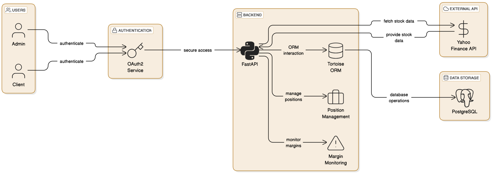
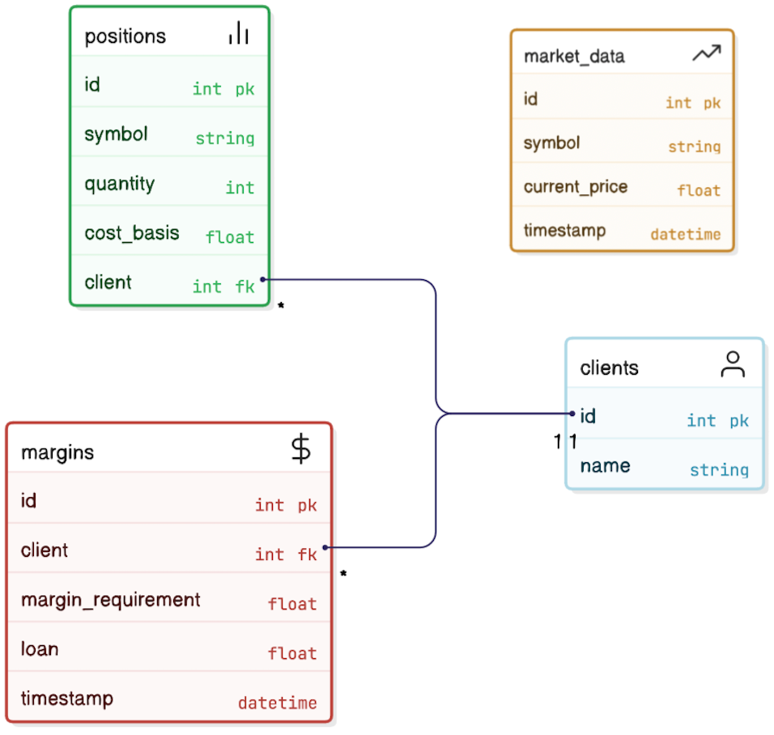

# Risk System Backend
## Overview
This backend project powers a Risk Management System designed to fetch stock data, manage client positions, and monitor margin requirements in real-time. Built using FastAPI for rapid API development, it utilizes Tortoise ORM with PostgreSQL as the database, and integrates Yahoo Finance to fetch live stock prices. Additionally, the system uses OAuth2 authentication for secure access to the APIs.



## Key Features
- OAuth2 Authentication: Secure login and token-based authentication for clients, ensuring that only authorized users can access the system’s data.
- Stock Data Fetching: Real-time stock data retrieval using Yahoo Finance API, storing and updating market prices regularly.
- Client Position Management: Allows users to view and manage client stock positions, including the symbol, quantity, and cost basis.
- Margin Requirement Monitoring: Calculates and monitors margin requirements for each client based on their portfolio, highlighting any margin shortfalls or triggering margin calls.
# Setup Instructions
## Step 1. Create virtual env
```{shell}
python -m venv venv
```
## Step 2. Activate then install Dependencies
For macOS/Linux:
```{shell}
source venv/bin/activate
```
For Windows (Command Prompt):
```{shell}
venv\Scripts\Activate.ps1
```
## Step 3. Install Dependencies
```{shell}
pip install -r requirements.txt
```
## Step 4. Setup Database
Modify the `DATABASE_URL` in `config.py` to point to your PostgreSQL instance.

## Step 5. Run main.py in virtual env
```{shell}
python3 main.py
```
## Step 6. Run insert_data.py to create some clients data
```{shell}
python3 insert_data.py
```

# API Endpoints
## Fetch Real-time Stock Data
GET /stocks/{symbol}
- Description: Retrieves the latest stock price from Yahoo Finance and stores it in the database.
- Parameters:
    - symbol (string): Stock ticker symbol (e.g., "AAPL").
- Response:
```{json}
{
  "symbol": "AAPL",
  "timestamp": "2024-03-28T10:30:00Z",
  "current_price": 175.50
}
```
## Retrieve All Stored Stock Data
GET /stocks
- Description: Fetches all stock data stored in the database.
- Response: List of stock records.
## Get Client Positions
GET /positions/{clientId}
- Description: Retrieves all stock positions for a given client.
- Parameters:
    - `clientId` (integer): Unique identifier of the client.
- Response:
```{json}
{
  "clientId": 1,
  "positions": [
    {"symbol": "AAPL", "quantity": 100, "cost_basis": 150.0}
  ]
}
```
## Get Margin Status for a Client
GET /margin/{clientId}
- Description: Computes and retrieves margin status for a client.
- Parameters:
    - `clientId` (integer): Unique identifier of the client.
- Response:
```{json}
{
  "timestamp": "2024-03-28T10:30:00Z",
  "clientId": 1,
  "portfolio_value": 20000.0,
  "loan_amount": 10000.0,
  "net_equity": 10000.0,
  "margin_requirement": 5000.0,
  "margin_shortfall": 0.0,
  "margin_call_triggered": false
}
```
# Database Models



## 1. Client
Stores client details.
```{python}
class Client(Model):
    id = fields.IntField(pk=True)
    name = fields.CharField(max_length=255)
```
## 2. Position
Stores client stock holdings.
```{python}
class Position(Model):
    id = fields.IntField(pk=True)
    symbol = fields.CharField(max_length=10)
    quantity = fields.IntField(null=True)
    cost_basis = fields.FloatField()
    client = fields.ForeignKeyField("models.Client", related_name="positions")
```
## 3. MarketData
Stores stock prices fetched from real-time market data API.
```{python}
class MarketData(Model):
    id = fields.IntField(pk=True)
    symbol = fields.CharField(max_length=50)
    current_price = fields.FloatField()
    timestamp = fields.DatetimeField()
```
## 4. Margin
Stores margin requirements for clients. If we store all the historical margin requirement for clients, it is a big burden for database. So I choose to calculate portfolio values on the fly.
```{python}
class Margin(Model):
    id = fields.IntField(pk=True)  # Auto-increment primary key
    client = fields.ForeignKeyField("models.Client", related_name="margins", on_delete=fields.CASCADE)
    margin_requirement = fields.FloatField()
    loan = fields.FloatField()
    timestamp = fields.DatetimeField(default=datetime.datetime.now)
```
# Tech Stack
## Overview of the tools that we use
| Component                  | Description                                                                 | URL                                       |
|----------------------------|-----------------------------------------------------------------------------|-------------------------------------------|
| **Backend Framework**: FastAPI        | A modern, fast (high-performance) web framework for building APIs with Python 3.7+. It's easy to use, based on standard Python type hints. | [FastAPI Documentation](https://fastapi.tiangolo.com/) |
| **Realtime Trading API**: Yahoo Finance | Provides access to stock market data, historical data, and financial news. It is used for fetching real-time market prices and historical stock information. | [Yahoo Finance](https://www.yahoofinanceapi.com/) |
| **Middleware**: Tortoise ORM | An easy-to-use asyncio ORM (Object Relational Mapper) built for Python with support for asynchronous programming, commonly used with databases like PostgreSQL. | [Tortoise ORM GitHub](https://github.com/tortoise/tortoise-orm) |
| **Database**: PostgreSQL 14.17 | A powerful, open-source object-relational database system, known for its scalability, reliability, and extensibility. | [PostgreSQL Official Site](https://www.postgresql.org/) |
| **Dependencies**: Python 3.10.9 and `requirements.txt` | The version of Python used for the application along with a `requirements.txt` file to specify all necessary dependencies. | [Python Official Site](https://www.python.org/) |
## Comparision of backend frameworks
| Feature           | FastAPI              | Django                 | Flask                  | Tornado                | Pyramid                |
|------------------|---------------------|------------------------|------------------------|------------------------|------------------------|
| **Type**         | Asynchronous (ASGI)  | Synchronous (WSGI)     | Synchronous (WSGI)     | Asynchronous (ASGI)    | Synchronous (WSGI)     |
| **Performance**  | High                 | Moderate               | Moderate               | High                   | Moderate               |
| **Ease of Use**  | Easy to learn        | Moderate (Full-Stack)  | Very easy (Minimal)    | Moderate (Async-based) | Moderate               |
| **Built-in Features** | Minimal, Pydantic validation | Full-stack (ORM, Admin, Auth) | Minimal | WebSockets, Async I/O | Minimal |
| **Asynchronous Support** | Yes, built-in | Limited (Django 3+) | Limited (via extensions) | Yes, fully async | Limited |
| **Use Case**     | APIs, Microservices  | Full-stack applications | Lightweight applications | Real-time applications | Customizable web apps |
| **ORM Support**  | Tortoise ORM, SQLAlchemy | Django ORM | SQLAlchemy, Flask-SQLAlchemy | Custom | SQLAlchemy, ZODB |
| **WebSockets**   | Yes, built-in        | No (via Channels)      | No (via Flask-SocketIO) | Yes, built-in          | No                     |
| **Documentation**| Excellent            | Extensive              | Good                   | Moderate               | Moderate               |
| **Community Support** | Growing          | Very Large             | Large                  | Small                  | Moderate               |

## Comparision of database
| Feature                         | Oracle Database       | Microsoft SQL Server  | PostgreSQL          | MySQL               | MongoDB            | Redis              |
|---------------------------------|-----------------------|-----------------------|---------------------|---------------------|--------------------|--------------------|
| **Primary Use Case**            | Enterprise-level transactions and analytics | Enterprise-level transactions | Data warehousing, financial analysis | Transactional systems, analytics | NoSQL document-based storage | Caching, high-speed transactions |
| **Data Model**                  | Relational            | Relational            | Relational          | Relational          | Document-oriented  | Key-value store    |
| **ACID Compliance**             | Yes                   | Yes                   | Yes                 | Yes                 | No                 | No                 |
| **SQL Support**                 | Full SQL support      | Full SQL support      | Full SQL support    | Full SQL support    | Limited SQL support | No                 |
| **Transactions (ACID)**         | Yes                   | Yes                   | Yes                 | Yes                 | No                 | No                 |
| **Horizontal Scaling**          | Yes (with Oracle RAC) | Yes (with Always On Availability Groups) | Yes (with Citus extension) | Yes (with Galera Cluster) | Yes (with sharding) | Yes (with clustering) |
| **Vertical Scaling**            | Yes                   | Yes                   | Yes                 | Yes                 | No (sharding)      | Yes (in-memory)    |
| **Query Performance**           | High (optimized for large-scale enterprise queries) | High (optimized for transactional workloads) | High (supports complex queries) | High (well-suited for web apps) | Low to moderate (document search) | Extremely fast for small, simple queries |
| **Data Integrity**              | High (strong consistency) | High (strong consistency) | High (strong consistency) | High (strong consistency) | Low (eventual consistency) | Low (eventual consistency) |
| **Data Replication**            | Yes (advanced replication options) | Yes (Always On)       | Yes (synchronous and asynchronous) | Yes (master-slave replication) | Yes (replica sets) | Yes (master-slave replication) |
| **Concurrency Control**         | Multi-version concurrency control (MVCC) | Lock-based concurrency | MVCC                | Lock-based concurrency | Eventual consistency | Single-threaded |
| **Licensing Model**             | Paid (Enterprise licenses) | Paid (Enterprise licenses) | Open-source, Paid options | Open-source, Paid options | Open-source, Paid options | Open-source, Paid options |
| **Cost**                         | High                  | High                  | Free                | Free                | Free               | Free (paid for enterprise versions) |
| **Cloud Deployment**            | Yes (Oracle Cloud, AWS, Azure, GCP) | Yes (Azure)           | Yes (AWS, Azure, GCP) | Yes (AWS, Azure, GCP) | Yes (AWS, Azure, GCP) | Yes (AWS, Azure, GCP) |
| **Industry Adoption**           | Widely adopted in banking, investment firms, insurance | Widely adopted in banking, corporate finance | Widely used in analytics, fintech, startups | Widely used in fintech, startups, web applications | Increasing in fintech for unstructured data | Popular for caching in high-performance environments |

## Comparision of real-time market data API 
The pros and cons of popular market data APIs including Twelve Data, IEX Cloud, Alpha Vantage with a real-time plan, Yahoo Finance, Moomoo and IBKR
- Tried IBKR, real time data is too expensive, charges by usage
- Tried Moomoo, real time data for US stock is charged, but HK stock is free
- Will try **Alpha Vantage** soon.

|<p>Feature/</p><p>Provider</p>|<p>Twelve</p><p>Data</p>|IEX Cloud|<p>Alpha</p><p>Vantage</p>|<p>Yahoo</p><p>Finance</p>|Moomoo|<p>Interactive</p><p>Brokers</p>|
| :- | :- | :- | :- | :- | :- | :- |
|<p>Real-time</p><p>Data</p>|Yes|<p>Yes</p><p>(delayed)</p>|Yes|<p>Yes</p><p>(delayed)</p>|Yes|Yes|
|Granularity|1-minute|1-minute|1-minute|<p>15-min</p><p>delay</p>|1-minute|1-minute|
|<p>Data</p><p>Coverage</p>|Global|US only|Global|US only|US only|Global|
|API Rate Limit|<p>5/min</p><p>(free)</p>|<p>50,000/</p><p>month</p>|5/min (free)|N/A|N/A|Varies|
|<p>Historical</p><p>Data</p>|Yes|Yes (limited)|Yes|Yes|Yes|Yes|
|<p>Premium Plan</p><p>Cost</p>|<p>$29/</p><p>month</p>|$9/month|<p>$29.99/</p><p>month</p>|Free|Free|Depends on equity and subsctiption fee|
|<p>Additional</p><p>Features</p>|<p>Crypto,</p><p>Forex</p>|<p>Financials,</p><p>News</p>|<p>Technical</p><p>Indicators</p>|Basic Data|<p>Charting,</p><p>Trading</p>|<p>Advanced</p><p>Trading Tools</p>|

## Comparision of authorization framework
- OAuth2 → Best for API security (but lacks authentication).
- OpenID Connect (OIDC) → Adds authentication to OAuth2 (good for logins).
- SAML → Used for enterprise SSO (corporate environments).
- JWT → Lightweight, stateless token-based auth (good for microservices & APIs).

| Feature           | OAuth2.0 | OpenID Connect (OIDC) | SAML | JWT |
|------------------|---------|----------------------|------|-----|
| **Type**        | Authorization | Authentication + Authorization | Authentication + Authorization | Token-based Authorization |
| **Token Type**  | Access Token | ID Token + Access Token | SAML Assertion | JWT (HS256/RS256) |
| **Stateful?**   | Optional | Optional | Usually Stateful | Stateless |
| **Use Case**    | API Security, Delegated Auth | SSO, API Security | Enterprise SSO | API Auth, Microservices |
| **Third-Party Auth** | ✅ Yes | ✅ Yes | ✅ Yes | ❌ No (Self-contained) |
| **Requires Identity Provider?** | ✅ Yes | ✅ Yes | ✅ Yes | ❌ No |
| **Common Usage** | Google Login, GitHub OAuth | Google Sign-In, Azure AD, Okta | Enterprise SSO (corporate logins) | API security, microservices |
| **Best For**    | API authorization | Authentication + API Access | Enterprise SSO (large orgs) | Stateless API access |


## Contributing
Feel free to fork this repository, submit issues, or create pull requests. If you would like to contribute to the project, please follow the steps below:

## License
This project is licensed under the MIT License - see the LICENSE file for details.
